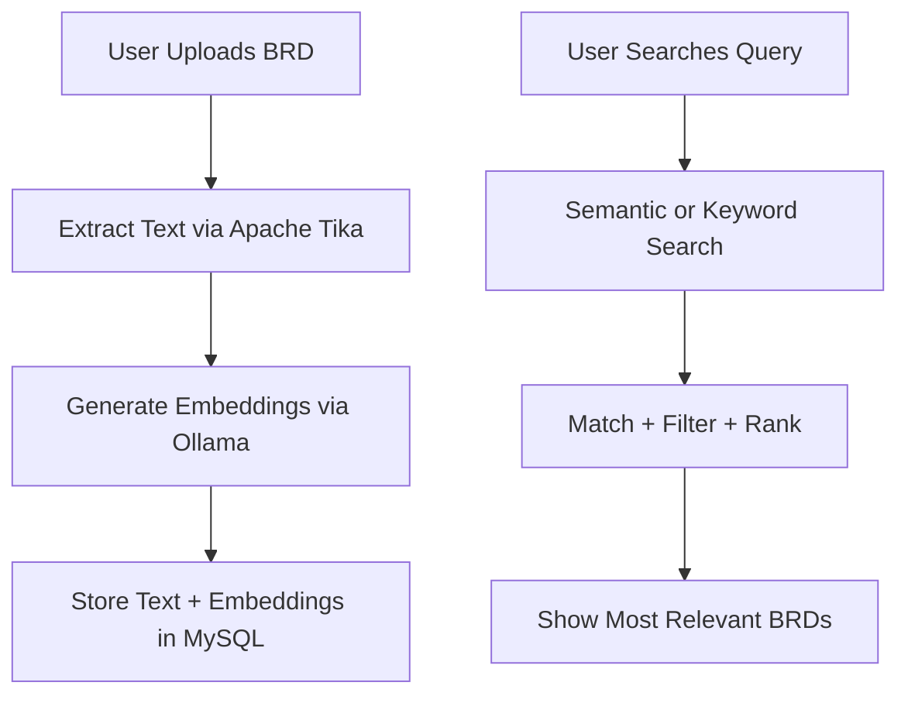

# 🚀 AI-Powered BRD Search & Knowledge Retrieval System

A smart document intelligence platform that helps teams quickly upload BRDs, extract content, and find related past work using **AI-powered semantic search**.  
Designed to reduce repeated effort, improve knowledge reuse, and accelerate ticket analysis.

---

## 🌟 Features

### ✔ BRD Upload  
Easily upload BRDs (PDF, Word, etc.). The system extracts text automatically.

### ✔ AI Semantic Search  
Search BRDs by **meaning**, not just by keywords.  
Example search queries:  
- "member eligibility logic"  
- "claim validation rules"  
- "payment posting scenario"

### ✔ Related Document Finder  
Find who worked on similar functionality before and retrieve related BRDs instantly.

### ✔ Exact + Semantic Search  
Support for both traditional keyword search and vector similarity search.

### ✔ Relevance Filtering  
Low-similarity results are removed using a configurable threshold.

---

## 🧠 High-Level Architecture

##How It Works
### ✔🔹 1. Document Upload

-User uploads a BRD file.
-Apache Tika extracts its text.
-AI model (nomic-embed-text via Ollama) converts it into an embedding.
Text + embedding + metadata are saved.

### ✔🔹 2. Semantic Search

Query text is embedded using the same model
Cosine similarity compares it with stored embeddings
Only relevant matches (above threshold) are returned
Results are ranked by similarity score

### ✔🔹 3. Results

The user sees:
Matching BRDs
Relevant sections
Who worked on them
Confidence score (optional)

